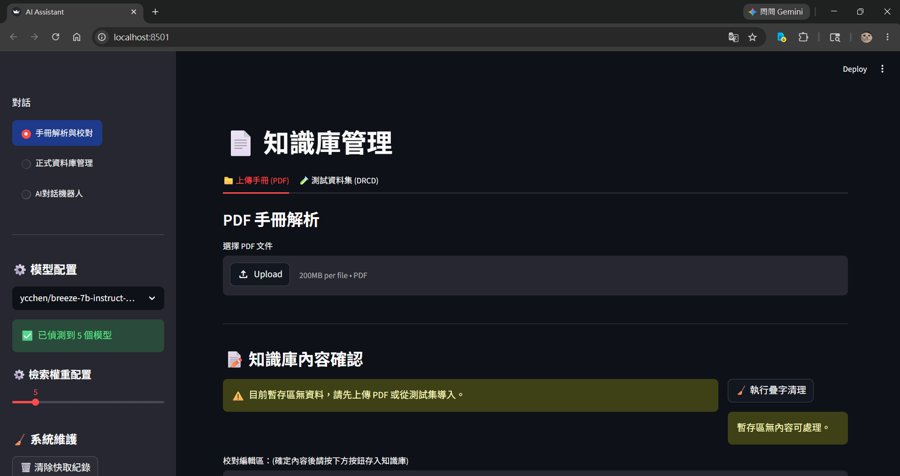
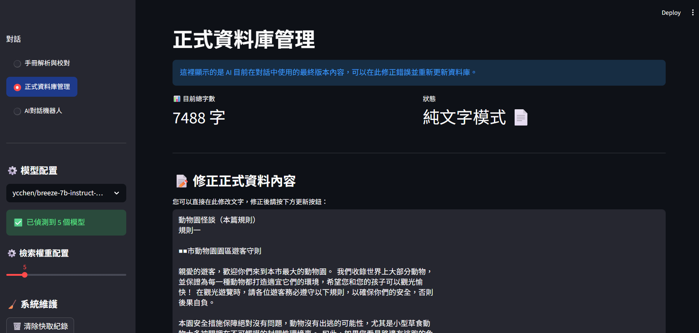
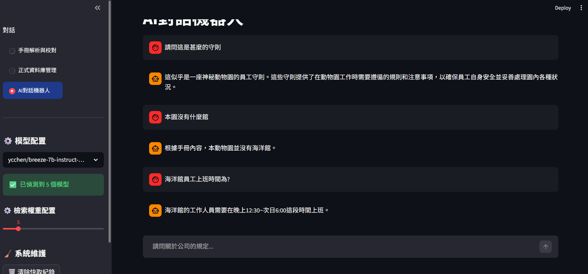

# AI-bot-fot-pdf
基於 Ollama模型實作的 RAG 檢索Streamlit介面助手。支援 PDF 解析、自動疊字清理、動態 K 值檢索，並整合聯發科Breeze-7B等中文模型提供精準對話。

# 1. 安裝

#### 安裝所需套件
```bash
pip install -r requirements.txt
```
#### 啟動 Ollama 並下載模型
```bash
ollama run ycchen/breeze-7b-instruct-v1_0:latest
```
#### 啟動
```bash
streamlit run AI-bot-fot-pdf.py
```
#  主頁

#  資料庫頁面

#  對話頁面


# 2. 評分

### RAG模型效能評測
每個PDF測試10個題目，共有4個PDF：

* [一零四資訊科技股份有限公司誠信經營守則](https://corp.104.com.tw/archive/storage/comlaw/filename_3.pdf) <5000字

* [動物園怪談](https://home.gamer.com.tw/artwork.php?sn=5403741) 5000~10000字

* [華夏海灣塑膠股份有限公司員工工作規則](https://www.cgpc.com.tw/PDF/others/employee_rule.pdf) 10000~20000字

* [勞動部工作規則參考手冊](https://www.mol.gov.tw/media/44vncxzt/%E5%B7%A5%E4%BD%9C%E8%A6%8F%E5%89%87%E5%8F%83%E8%80%83%E6%89%8B%E5%86%8A-115%E5%B9%B41%E6%9C%88%E7%89%88%E6%9C%AC.pdf?mediaDL=true) 20000字以上

並設定K值1、5、10(向量搜尋，設定10000字以上才會啟用)


### 規則：每個PDF共10題滿分10分，繁中回覆正確得分，簡中回覆正確得分*0.1

1. <5000字、5000~10000字

| 模型名稱 | <5000字 | 5000~10000字  | 備註 |
| :--- | :---: | :---: | :--- |
| **Breeze-7B** | 10 | 7 | 聯發科模型，繁體支援度較高 |
| **TAIDE-8B** | 10 | 7 | 法律術語精準 |
| **Gemma-4** | 10 | 2 | 模型回覆冗長 |
| **Qwen-2.5** | 8 | 0.3 | 會出現簡體回覆 |
| **Llama-3.2** | 8 | 3 | 適合小資料，大型集易幻覺 |


2. 10000~20000字
   
| 模型名稱\K | K=1 | K=5  | K=10  | K=20  |
| :--- | :---: | :---: | :---: | :---: |
| **Breeze-7B** | 1 | 4 | 6 | 1 |
| **TAIDE-8B** | 1 | 4 | 3 | 1|
| **Gemma-4** | 0 | 5 | 0 | 0 |
| **Qwen-2.5** | 1.1 | 2.3 | 0.3 | 0 |
| **Llama-3.2** | 1 | 5 | 2 | 2  |

3. 20000字以上
   
| 模型名稱\K | K=1 | K=5  | K=10 |  K=20  |
| :--- | :---: | :---: | :---: | :---: |
| **Breeze-7B** | 6 | 5 | 3 | 0 |
| **TAIDE-8B** | 5 | 5 | 6 | 1 |
| **Gemma-4** | 10 | 7 | 0 | 0 |
| **Qwen-2.5** | 4 | 0.6 | 0.1 | 0 |
| **Llama-3.2** | 5 | 5 | 0 | 1 |

# 3. 分析

| 模型名稱 | 總得分(滿分100) |
| :--- | :---: |
| **Breeze-7B** | 43 |
| **TAIDE-8B** | 43 |
| **Gemma-4**  | 34 |
| **Qwen-2.5** | 16.7 |
| **Llama-3.2** | 32 |

* 聯發科Breeze-7B 和 國研院TAIDE-8B 以 43 分並列第一，兩顆模型5000字以下獲得滿分，在10000字以下能達到7分。
* 10000字以上以向量搜尋為主，K值大小會影響檢索的文本量，K值較小時雜訊也較小，長文本表現更為靈敏(20000字以上)，當K值放大（K=10），文檔資訊量與雜訊變多時適合文字數較小的檢索與回覆(10000~20000字)。
